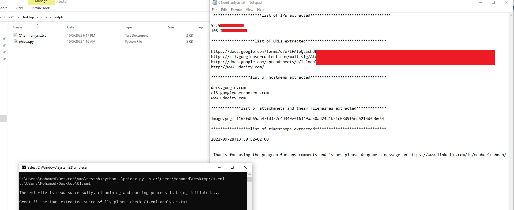
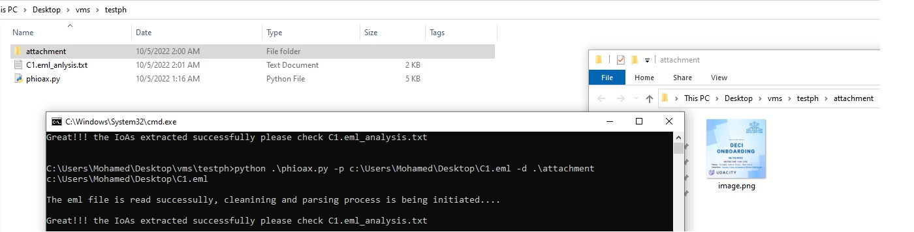

# phioax
If you would ask any security analyst or infosec engineer about phishing emails, he/she with no hesitation will tell you it's very common that phishing emails (especially the well deigned ones) do manage to evade email gateways and security controls, hence they usually get calls about suspicious emails received and asked to validate those emails.\
Manulally extracting all the email artificats consume time and some of them could be missed due to lack of experrience. So I wrote this python script to automate the extraction of those artifacts ,generate a text file with all the findings so the analyst can analyze them right away.
 

**Note:** so far the script works only with eml format.

# What the script can do so far?
* Extract the Public IP addresses pariticipated in the email delivery flow
* Extract URLs in the content
* Provide a list of all hostnames contained ( for domain analysis )
* Provide a list of the filenames attached and their corresponding filehashes ( *sha256* )
* Extract timestamps in the *Received* and *Date* headers then convert them to isoformatted, and calculate the time delta ( for detecting time anomalies)
* *[Optionally]* dumps the attachments to the local storage (if file analysis is needed)
* ViruTotal automated analysis on IPs, Hostnames, Filehashes 
* Extract the URLs from safelinks 
  
# Usage:
when using for the first time, install the required 3rd party libraries listsed in the requirements.txt file as follows:
>pip install -r requirements.txt 

Also make sure to update *api_keys.json* file with your VirusTotal API key

Usage:
>python .\phioax.py -h
>
>usage: phioax.py [-h] -p PATH [-d [DUMP]]
>
>This program is developed to help SOC analysts extracting Indicator of Attack from
>a suspicious email to check them agianst  OSINT resources
>
>options:
>
>  -h, --help            show this help message and exit
>
>  -p PATH, --path PATH >>> Mandatory: the path of the eml file
>
>  -d [DUMP], --dump [DUMP]
>                       >>> Optional: dumps the attachments to the path you specify
> [or to the current directory if not specified] for more manual analysis
  
\
 

#### using the -d (--dump) arguemnt to dump the attachments to your local storage  
\
  

# Future additions:
1) Automated check IoA (urls) with VirusTotal
2) optimize the script to  iterate through a directory containing multiple eml files and perform the analysis for all of them
3) process msg formatted messages
4) automated check for the sender/s against email breach and email pastes datasets of have I been Pwned
5) query sender/s dns for spf record and put them in the output file 
6) automated check on URLs to detect abnormal behaviors e.g. redirections or file download 
7) support IPv6 and idna domains extraction

